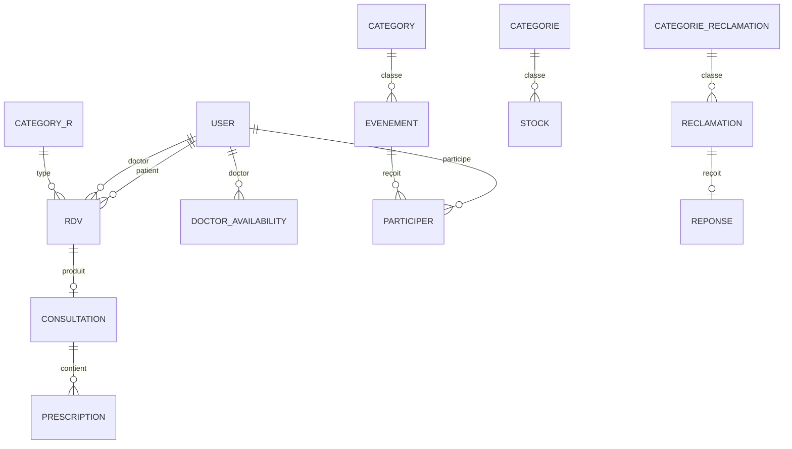
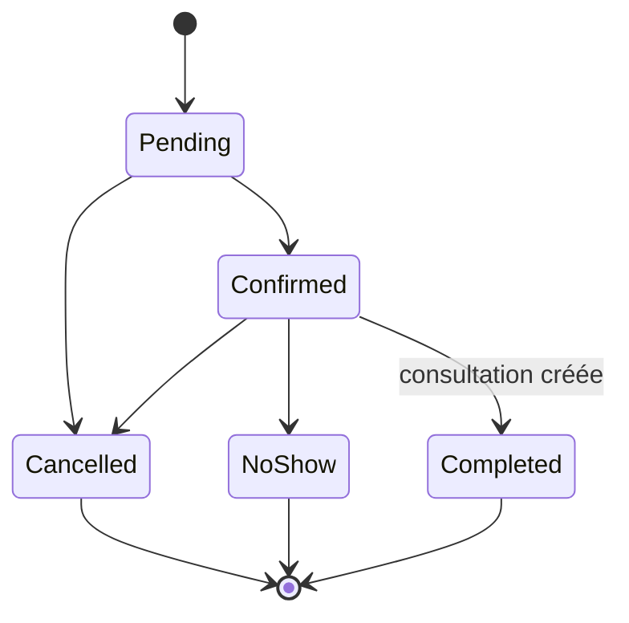

# Architecture de CliniClic

Ce document décrit les choix structurants de l’application après modernisation. L’objectif est de rester professionnel tout en conservant une architecture qu’un étudiant peut expliquer clairement en entretien.

## 1. Découpage applicatif

| Couche | Responsabilité | Exemples |
|---|---|---|
| Controller | Entrée HTTP, autorisation, formulaire, réponse | `RDVController`, `ConsultationController` |
| Form | Transformation et validation des entrées | `RDVType`, `ConsultationType` |
| Voter | Autorisation dépendante de l’objet et de son propriétaire | `AppointmentVoter`, `ConsultationVoter` |
| Service | Règles métier, transactions et orchestration | `AppointmentService`, `ConsultationService` |
| Repository | Requêtes Doctrine réutilisables et optimisées | `RDVRepository`, `ConsultationRepository` |
| Entity | État du domaine, relations et contraintes structurelles | `RDV`, `Consultation`, `User` |
| Twig | Présentation échappée et composants réutilisables | `templates/components/_flash.html.twig` |

Le contrôleur ne décide pas si un créneau est disponible : il délègue au service. Le service ne construit pas de réponse HTML : il retourne un résultat métier ou lève une exception métier lisible. Le voter ne modifie jamais les données.

## 2. Relations Doctrine principales

### Choix importants

- `RDV.patient` et `RDV.doctor` pointent vers `User` pour préserver le modèle historique sans ajouter trop d’abstraction.
- une consultation est unique par rendez-vous ; la contrainte existe en PHP et en base ;
- les suppressions de consultation et prescription ne sont pas proposées afin de préserver l’historique médical ;
- les disponibilités sont uniques par médecin, jour et plage horaire ;
- une participation est unique par couple utilisateur/événement ;
- les référentiels ont des contraintes d’unicité et des longueurs cohérentes avec les formulaires.

## 3. Autorisation

L’autorisation comporte trois niveaux complémentaires :

1. `access_control` interdit l’entrée dans une zone à un rôle inadapté ;
2. les attributs/contrôles du contrôleur protègent l’action ;
3. les voters vérifient l’assignation réelle de l’entité.

### Rendez-vous

- administrateur et réceptionniste : vue globale, création et opérations administratives autorisées selon le statut ;
- médecin : seulement les rendez-vous qui lui sont assignés ;
- patient : seulement ses propres rendez-vous ;
- modification administrative limitée aux demandes encore en attente ;
- annulation limitée aux statuts `pending` et `confirmed`.

### Dossier médical

- médecin assigné : lecture, création et édition de la consultation, ajout de prescriptions ;
- patient concerné : lecture seule ;
- administrateur et réceptionniste : accès refusé, même si un lien est saisi directement.

Cette séparation applique un principe de minimisation : administrer un compte ne donne pas automatiquement accès au contenu clinique.

## 4. Workflow des rendez-vous

`AppointmentService` applique les invariants suivants dans une transaction :

- date future ;
- durée positive ;
- patient et médecin dotés du rôle attendu ;
- plage couverte par une disponibilité active ;
- aucun chevauchement pour le médecin ;
- aucun chevauchement pour le patient ;
- transition de statut présente dans la liste autorisée.

Les lignes utilisateur médecin et patient sont verrouillées de manière pessimiste pendant la détection de conflit. Cela évite que deux requêtes concurrentes valident simultanément le même créneau. Une annulation n’est pas incluse dans les recherches de conflit et libère donc le créneau.

## 5. Consultations et prescriptions

`ConsultationService` vérifie que :

- l’auteur est le médecin assigné ;
- le rendez-vous est confirmé ;
- l’heure prévue est atteinte ;
- aucune consultation n’existe déjà ;
- la création de la consultation fait passer le rendez-vous à `completed`.

Les prescriptions sont rattachées à une consultation et valident le médicament, la dose, la fréquence et la cohérence des dates. Les pages médicales reçoivent des en-têtes HTTP `private, no-store`.

## 6. Données et performances

- pagination serveur Knp pour les grandes listes ;
- filtres conservés dans les liens de pagination ;
- jointures sélectionnées dans les repositories pour limiter les requêtes N+1 ;
- index composites sur médecin/date/statut et patient/date ;
- index uniques sur les référentiels et participations ;
- statistiques du tableau de bord calculées en base, jamais codées en dur ;
- verrous et transactions limités aux opérations où la concurrence a une conséquence métier.

## 7. Frontend

Deux layouts partagent une identité visuelle cohérente :

- `base_front.html.twig` pour le site public ;
- `base.html.twig` pour les espaces authentifiés avec navigation adaptée au rôle ;
- `base_auth.html.twig` pour connexion et inscription.

Bootstrap, les icônes et les styles sont servis localement. `public/assets/css/public.css` porte l’identité publique et `public/assets/css/clinic.css` l’espace applicatif. Les tableaux utilisent des conteneurs responsives, les formulaires ont des labels explicites et un lien d’évitement facilite la navigation clavier.

## 8. Sécurité des fichiers

Le projet existant ne contient pas de document médical uploadé. Les images publiques d’événement passent par `EventImageUploader` :

- fichier réellement uploadé et valide ;
- taille maximale 2 Mo ;
- MIME autorisé : JPEG, PNG ou WebP ;
- extension dérivée du MIME, jamais du nom original ;
- nom aléatoire de 32 caractères hexadécimaux ;
- remplacement et suppression limités au répertoire attendu.

Si des documents médicaux sont ajoutés plus tard, ils devront être stockés hors de `public/` et téléchargés via un contrôleur autorisé.

## 9. Décisions volontairement simples

- pas de CQRS, bus de messages, microservice ou agrégat complexe ;
- pas de profils séparés tant que les attributs métier ne le justifient pas ;
- pas de module financier ou documentaire ajouté artificiellement ;
- pas de suppression des anciennes colonnes de rendez-vous avant une stratégie explicite de migration des données historiques.

Ces choix réduisent le risque de régression et rendent l’application adaptée à un portfolio junior.
